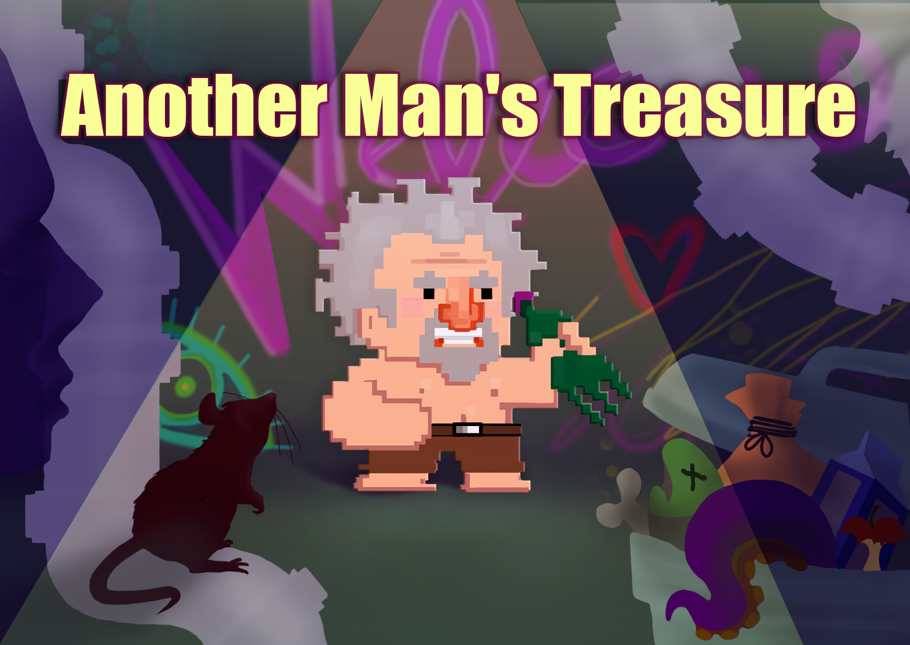

Made at Global Game Jam Online - Latvia 2020

# Another Man's Treasure

You play as a hobo, who's trying to survive in a hostile, trash-filled world. Use any items you find and make creative, yet deadly weapons with the power of duct-tape and a little elbow grease to fight your way across the junkyard!

## Installation

1. Download the repository and extract it
2. Open created folder and run the `.exe` file

## Controls

`WASD` - Movement

`Left Click` - Attack (Primary Weapon)

`1-6` - Consume Items

## Gameplay

## Credits

**Programmer:** [Toms Zvirbulis](https://github.com/tomszir)

**Developer:** [Juris Ozoliņš](https://github.com/RedBricc)

**Designer:** Anete Matvejeva
